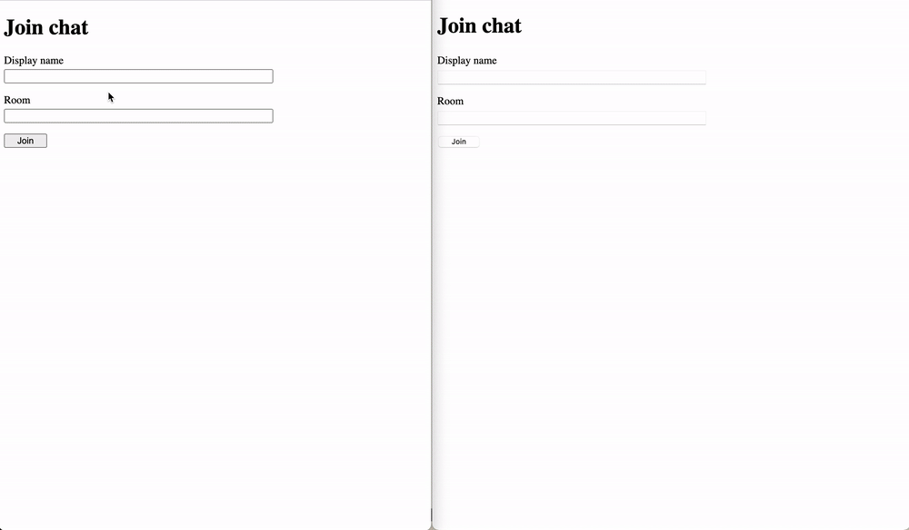

Chat App Example ✉️
==================

Simple chat application example with Node.js and Socket.io

</img>

# Installation

1. Clone the repo
2. Change directory to the app: `cd chat-app`
3. Install all dependencies: `yarn install`
4. Run the app: `yarn dev`

# Usage

Open browser at [localhost:3000](http://localhost:3000) and have fun 🎉
